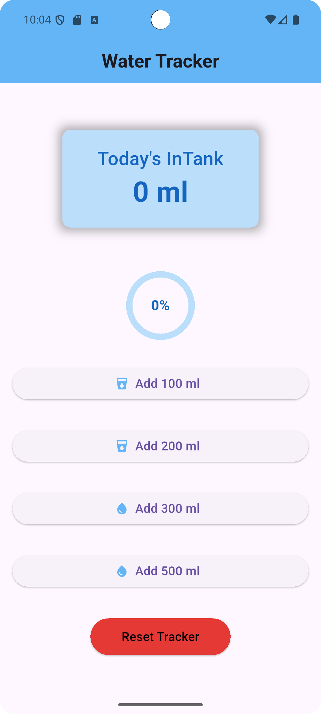
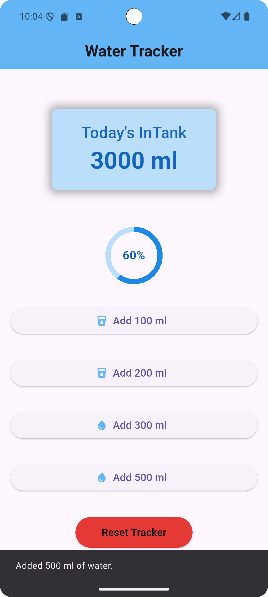
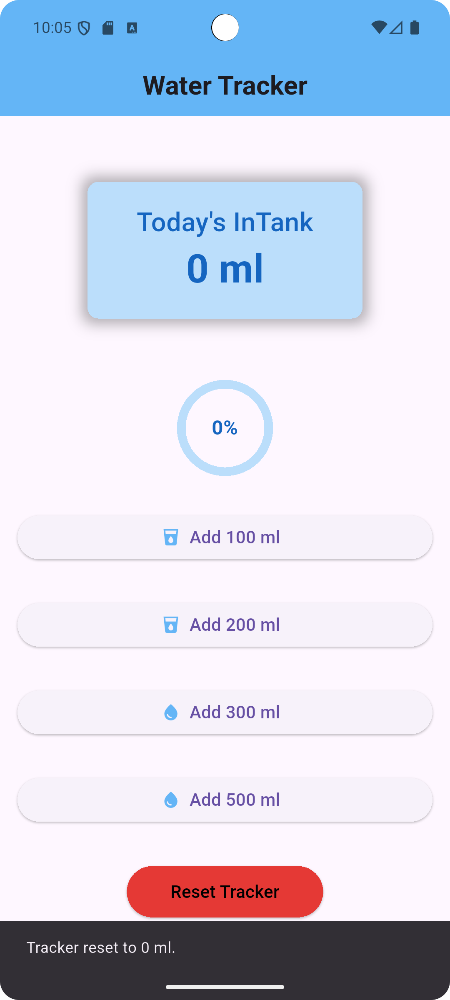

# 💧 Water Tracker App

A simple and clean Flutter app that helps you track your daily water intake. Stay hydrated and meet your health goals with just a few taps!

---

## 🚀 Features

- 🧮 Add water in customizable amounts (100ml, 200ml, 300ml, 500ml)
- 📈 View daily water intake progress with a circular progress bar
- 🧾 Real-time SnackBar notifications
- 🔁 Reset water tracker at any time

---

## 📸 Screenshots

| Main Screen | Progress Updated   | Reset SnackBar  |
|-------------|--------------------|-----------------|
|  |  |  |

---
